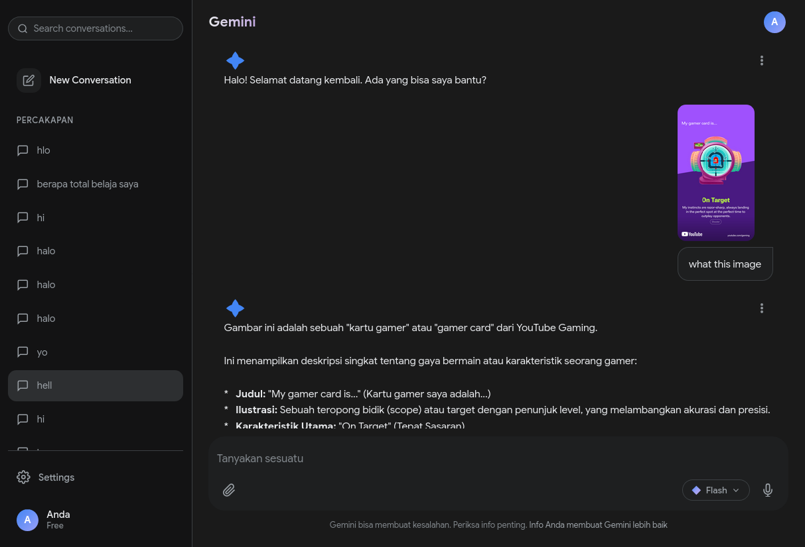

# Gemini Clone Chatbot

A beautiful Gemini-style AI chatbot clone built with Node.js, Express, and Google's Gemini AI API. Features a modern, responsive UI with multi-turn conversation support, file attachments, and conversation history.



## Features

- **Modern Gemini-like UI** - Clean, responsive interface inspired by Google's Gemini
- **Multi-turn Conversations** - Context-aware chat with conversation history
- **File Attachments** - Support for uploading and analyzing images and documents
- **Model Selection** - Switch between Gemini 2.5 Flash (fast) and Gemini 2.5 Pro (powerful)
- **Conversation History** - Automatically saves conversations to localStorage
- **Message Actions**:
  - Copy message text
  - Retry failed responses
  - Edit user messages
- **Responsive Design** - Works on desktop and mobile devices
- **Dark Theme** - Beautiful dark mode interface

## Prerequisites

Before you begin, ensure you have the following installed:

- [Node.js](https://nodejs.org/) (version 18 or higher)
- [npm](https://www.npmjs.com/) or [yarn](https://yarnpkg.com/)
- [Google AI Studio API Key](https://aistudio.google.com/app/apikey)

## Installation

### 1. Clone the Repository

```bash
git clone https://github.com/LilYoopug/gemini-clone-chatbot.git
cd gemini-clone-chatbot
```

### 2. Install Dependencies

```bash
npm install
```

### 3. Configure Environment Variables

Copy the example environment file and add your API key:

```bash
cp .env.example .env
```

Edit `.env` and add your Gemini API key:

```env
GEMINI_API_KEY=your_actual_api_key_here
PORT=3000
```

**Get your API key:**
1. Visit [Google AI Studio](https://aistudio.google.com/app/apikey)
2. Sign in with your Google account
3. Click "Create API Key"
4. Copy the key and paste it in your `.env` file

### 4. Start the Server

```bash
npm start
```

Or for development with auto-restart:

```bash
npm run dev
```

### 5. Open in Browser

Navigate to `http://localhost:3000` in your web browser.

## Usage

### Starting a Conversation

1. Type your message in the input field at the bottom
2. Press Enter or click the send button
3. The AI will respond with a generated message

### Attaching Files

1. Click the paperclip icon in the input area
2. Select an image or document file
3. The file preview will appear above the input
4. Type your message (optional) and send

**Supported file types:**
- Images: PNG, JPG, JPEG, GIF, WEBP
- Documents: PDF, TXT, JSON, and more

### Switching Models

1. Click the model selector button (default: "Flash") in the input area
2. Select either:
   - **Gemini 2.5 Flash** - Fast responses for everyday tasks
   - **Gemini 2.5 Pro** - Best performance for code and complex logic

### Managing Conversations

- **New Chat**: Click the "+" button in the sidebar or the pencil icon in the top bar
- **View History**: Previous conversations are listed in the left sidebar
- **Search**: Use the search box to find past conversations
- **Retry Message**: Click the three dots on an AI message and select "Coba lagi" to regenerate the response

## Project Structure

```
gemini-clone-chatbot/
├── index.js              # Express server and API routes
├── package.json          # Project dependencies
├── .env                  # Environment variables (not in git)
├── .env.example          # Example environment file
├── .gitignore           # Git ignore rules
├── README.md            # This file
├── public/              # Static frontend files
│   ├── index.html       # Main HTML page
│   ├── style.css        # Stylesheet
│   └── script.js        # Frontend JavaScript
└── screenshots/         # UI screenshots
    └── gemini-clone-ui.png
```

## API Endpoints

### POST /api/chat

Send a conversation to the Gemini AI and get a response.

**Request Body:**
```json
{
  "conversation": [
    {
      "role": "user",
      "text": "Hello!",
      "files": [
        {
          "name": "image.png",
          "type": "image/png",
          "data": "data:image/png;base64,iVBORw0KGgo..."
        }
      ]
    },
    {
      "role": "model",
      "text": "Hello! How can I help you today?"
    }
  ],
  "model": "gemini-2.5-flash"
}
```

**Response:**
```json
{
  "result": "AI generated response text"
}
```

## Technologies Used

- **Backend:**
  - Node.js
  - Express.js
  - @google/genai (Google's official Gemini SDK)
  - dotenv (Environment variables)
  - cors (Cross-origin requests)

- **Frontend:**
  - Vanilla JavaScript (ES6+)
  - HTML5
  - CSS3 with CSS Variables
  - localStorage (Conversation persistence)

## Environment Variables

| Variable | Description | Required |
|----------|-------------|----------|
| `GEMINI_API_KEY` | Your Google Gemini API key | Yes |
| `PORT` | Server port (default: 3000) | No |

## Available Models

| Model | Description | Best For |
|-------|-------------|----------|
| `gemini-2.5-flash` | Fast, efficient model | Everyday tasks, quick responses |
| `gemini-2.5-pro` | Most capable model | Complex reasoning, coding, analysis |

## Troubleshooting

### API Key Issues

**Error:** `Failed to generate response`

- Check that your API key is correctly set in `.env`
- Verify the API key is valid at [Google AI Studio](https://aistudio.google.com/app/apikey)
- Ensure you have billing enabled (free tier available)

### Rate Limiting

If you see `429 RESOURCE_EXHAUSTED` errors:
- You've hit the free tier rate limit
- Wait a few minutes before trying again
- Consider upgrading your Google AI Studio plan

### Port Already in Use

If port 3000 is already in use:
1. Change the port in `.env`: `PORT=3001`
2. Restart the server

## Development

### Running Locally

```bash
# Install dependencies
npm install

# Start development server
npm run dev

# Or start production server
npm start
```

### Building for Production

The application is ready for production deployment. Simply:

1. Set up environment variables on your server
2. Run `npm install --production`
3. Start with `npm start`

### Deploying to Cloud Platforms

**Vercel:**
```bash
npm i -g vercel
vercel
```

**Railway:**
```bash
npm i -g @railway/cli
railway login
railway up
```

**Render:**
Connect your GitHub repository to Render and it will auto-deploy.

## Contributing

Contributions are welcome! Please feel free to submit a Pull Request.

1. Fork the repository
2. Create your feature branch (`git checkout -b feature/AmazingFeature`)
3. Commit your changes (`git commit -m 'Add some AmazingFeature'`)
4. Push to the branch (`git push origin feature/AmazingFeature`)
5. Open a Pull Request

## License

This project is open source and available under the [MIT License](LICENSE).

## Acknowledgments

- Built with [Google Gemini AI](https://ai.google.dev/)
- UI inspired by [Google Gemini](https://gemini.google.com)

## Support

If you found this project helpful, please consider giving it a star on GitHub!

---

**Note:** This is a clone project for educational purposes. It is not affiliated with or endorsed by Google.
